# Generated Game Assets

This document lists all the image generation prompts from `PROMPTS.md` and links them to the corresponding images generated by Nano Banana. The images are named sequentially based on their generation order.

---

## Phase 0: Style Seeking (3 probes)

### S1 — Scene Probe: The Study

**Prompt:**
> **Style:** Dark noir detective illustration, ink linework with muted watercolor washes. Color palette: near-black backgrounds (#0a0a0f), deep navy surfaces (#14141f), warm cream highlights (#e8e6e3), antique gold accents (#d4a843), deep crimson (#c8463b), muted teal (#2a9d8f). 1920s murder mystery atmosphere. Moody lighting with strong shadows. Transparent PNG where noted.
>
> A dark wood-paneled study in a Victorian manor. A heavy mahogany desk covered in scattered documents and an open briefcase. A whiskey decanter and glass sit on a side table. A crackling fireplace casts flickering orange light. Floor-to-ceiling bookshelves line the walls. A crumpled note lies on the floor near the desk. Rich, heavy atmosphere with deep browns, amber, and gold. Viewed at an angle from the door. No text.
>
> *This is a style reference test. Focus on establishing: ink linework weight, watercolor wash density, color palette accuracy (#0a0a0f, #14141f, #e8e6e3, #d4a843, #c8463b, #2a9d8f), and overall 1920s noir mood.*

**Generated Image:**
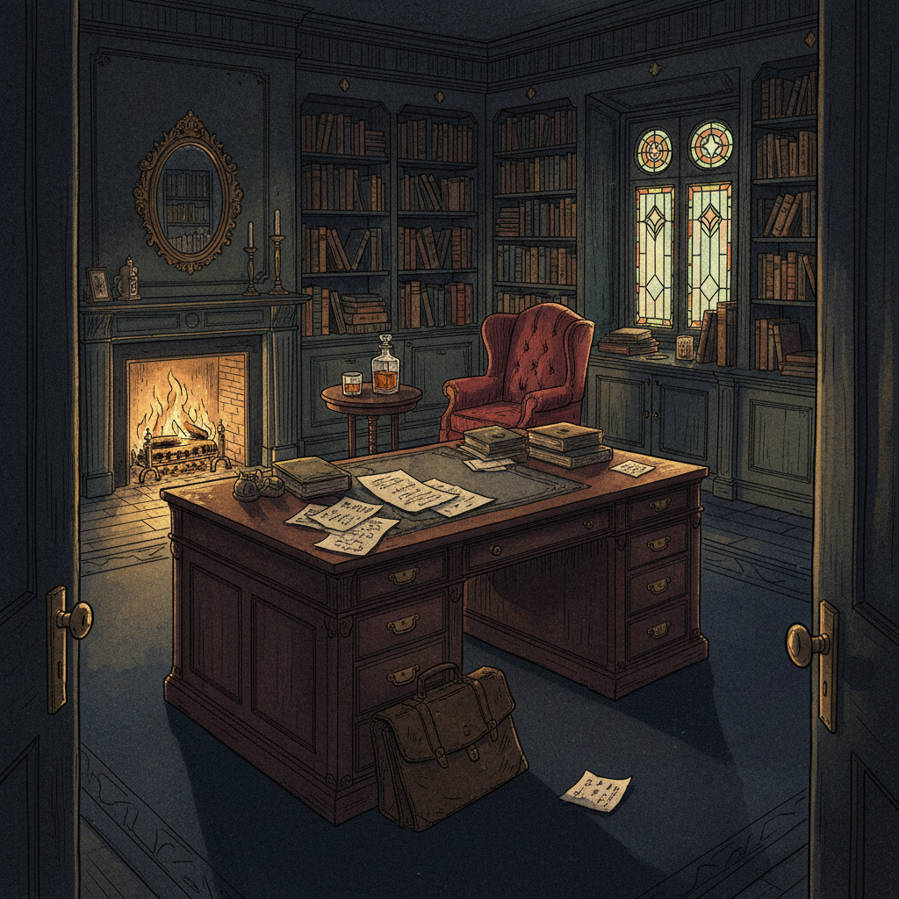

---

### S2 — Portrait Probe: Victor Ashford

**Prompt:**
> **Style:** Dark noir detective illustration, ink linework with muted watercolor washes. Color palette: near-black backgrounds (#0a0a0f), deep navy surfaces (#14141f), warm cream highlights (#e8e6e3), antique gold accents (#d4a843), deep crimson (#c8463b), muted teal (#2a9d8f). 1920s murder mystery atmosphere. Moody lighting with strong shadows. Transparent PNG where noted.
>
> Portrait of a middle-aged man in a sharp tailored suit with a silk tie. Clean-shaven, angular jawline, calculating dark eyes. Slicked-back hair. Confident but guarded expression — a man with secrets. Gold tie pin catches the light. Dramatic noir side-lighting. Bust/shoulder-up, 3/4 angle, looking slightly toward viewer. Ink linework with muted watercolor. Transparent background.
>
> *This is a style reference test. Focus on establishing: ink linework weight, watercolor wash density, color palette accuracy (#0a0a0f, #14141f, #e8e6e3, #d4a843, #c8463b, #2a9d8f), and overall 1920s noir mood.*

**Generated Image:**
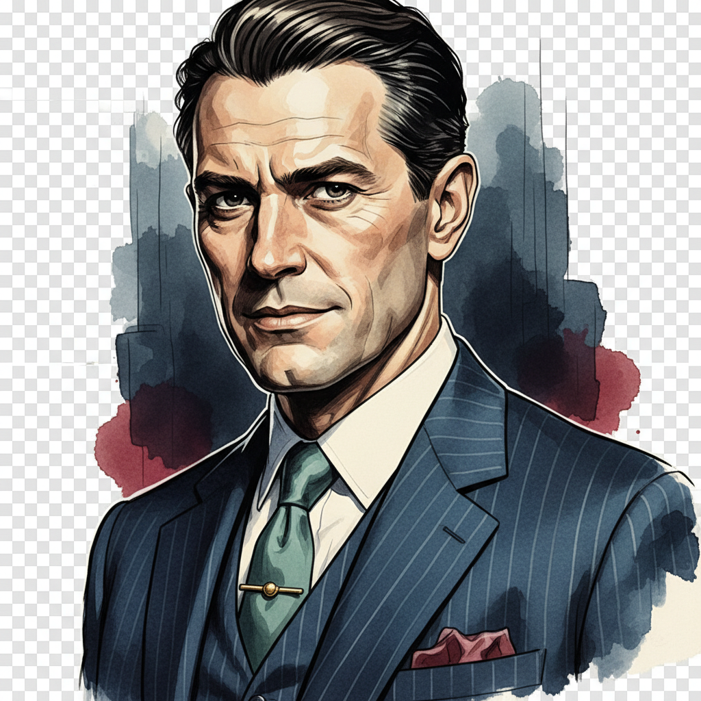

---

### S3 — Icon Probe: Poison Vial

**Prompt:**
> **Style:** Dark noir detective illustration, ink linework with muted watercolor washes. Color palette: near-black backgrounds (#0a0a0f), deep navy surfaces (#14141f), warm cream highlights (#e8e6e3), antique gold accents (#d4a843), deep crimson (#c8463b), muted teal (#2a9d8f). 1920s murder mystery atmosphere. Moody lighting with strong shadows. Transparent PNG where noted.
>
> A small glass vial with a cork stopper containing luminous green-purple liquid. A skull-and-crossbones label partially visible. Faint vapor wisps from the top. Crimson undertone accent. Centered on transparent background. 200x200px. Ink linework with watercolor.
>
> *This is a style reference test. Focus on establishing: ink linework weight, watercolor wash density, color palette accuracy (#0a0a0f, #14141f, #e8e6e3, #d4a843, #c8463b, #2a9d8f), and overall 1920s noir mood.*

**Generated Image:**
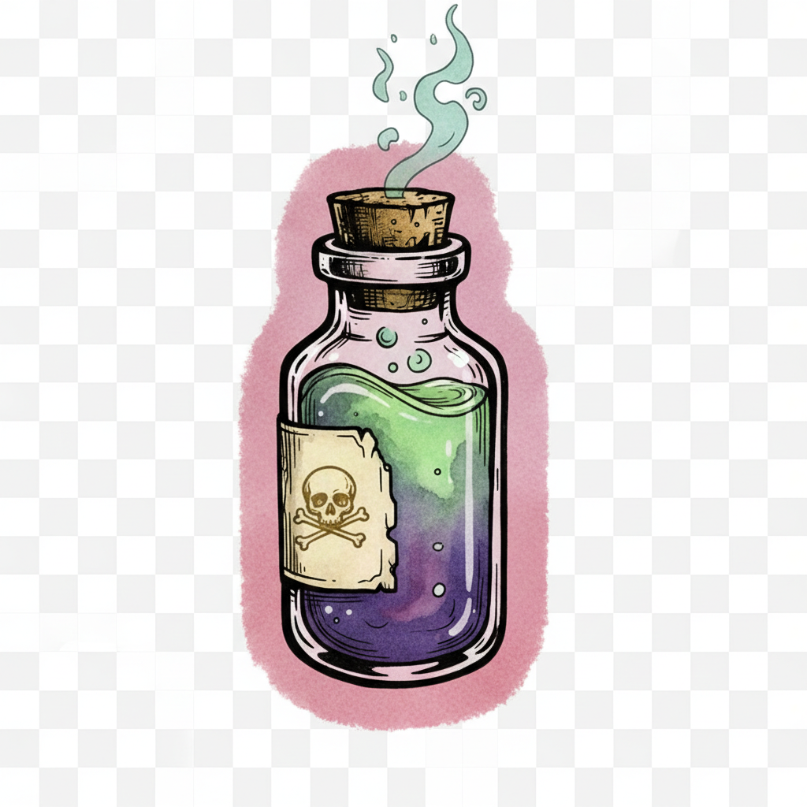

---

## Phase 1: Production Assets (31 prompts)

### A. TITLE SCREEN (1 asset)

### A1 — Meridian Manor Exterior

**Prompt:**
> **Style:** Dark noir detective illustration, ink linework with muted watercolor washes. Color palette: near-black backgrounds (#0a0a0f), deep navy surfaces (#14141f), warm cream highlights (#e8e6e3), antique gold accents (#d4a843), deep crimson (#c8463b), muted teal (#2a9d8f). 1920s murder mystery atmosphere. Moody lighting with strong shadows. Transparent PNG where noted.
>
> A grand Victorian manor at night seen from the front garden path. Moonlit sky with thin clouds. The mansion has ornate architecture with five visible windows — one glowing faintly gold (the bedroom). Wrought iron gates in foreground. Rose bushes and hedges line the stone path. Atmospheric fog at the ground level. Dark silhouette of the manor against a deep navy sky. Ink linework with watercolor washes in navy, charcoal, and gold. Cinematic wide shot. No text.

**Generated Image:**
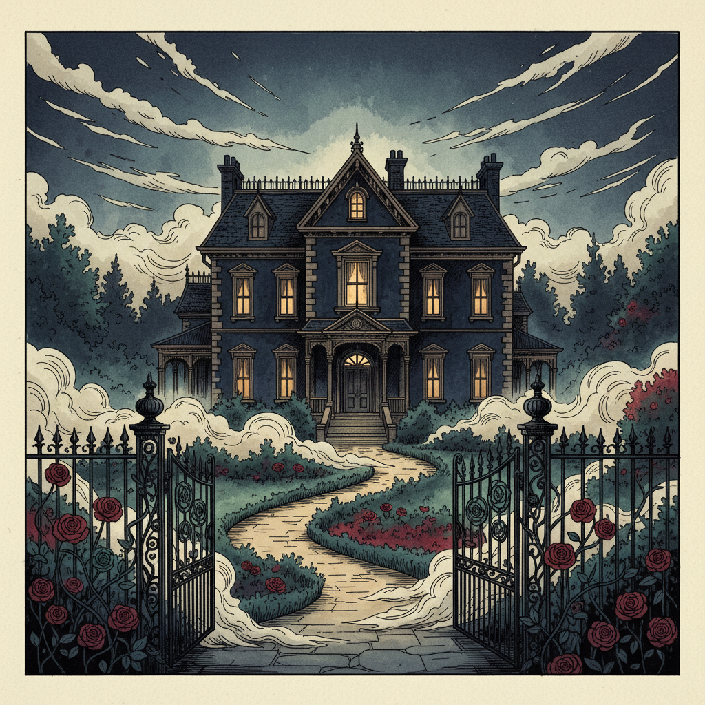

---

### B. ROOM ILLUSTRATIONS (5 assets)

### B1 — The Bedroom

**Prompt:**
> **Style:** Dark noir detective illustration, ink linework with muted watercolor washes. Color palette: near-black backgrounds (#0a0a0f), deep navy surfaces (#14141f), warm cream highlights (#e8e6e3), antique gold accents (#d4a843), deep crimson (#c8463b), muted teal (#2a9d8f). 1920s murder mystery atmosphere. Moody lighting with strong shadows. Transparent PNG where noted.
>
> A lavish master bedroom crime scene in a Victorian manor. Silk curtains frame a tall window overlooking a moonlit garden. An ornate nightstand with a shattered perfume bottle, its chemical residue visible. The bed is disheveled. Police tape or chalk outline subtly suggested. Dim golden lamplight casts long shadows across the room. Muted warm tones — cream, gold, deep shadows. Viewed from the doorway perspective. Atmospheric and unsettling. No text.

**Generated Image:**

---

### B2 — The Kitchen

**Prompt:**
> **Style:** Dark noir detective illustration, ink linework with muted watercolor washes. Color palette: near-black backgrounds (#0a0a0f), deep navy surfaces (#14141f), warm cream highlights (#e8e6e3), antique gold accents (#d4a843), deep crimson (#c8463b), muted teal (#2a9d8f). 1920s murder mystery atmosphere. Moody lighting with strong shadows. Transparent PNG where noted.
>
> A professional Victorian manor kitchen at night. Copper pots hang from ceiling racks. A marble counter has a half-prepared dessert and two wine glasses — one with a suspicious residue. A magnetic knife rack on the wall has one conspicuous empty slot. Gas lamps cast warm amber light. Tile floor with checkerboard pattern. Warm but tense atmosphere. Viewed from the entrance. No text.

**Generated Image:**
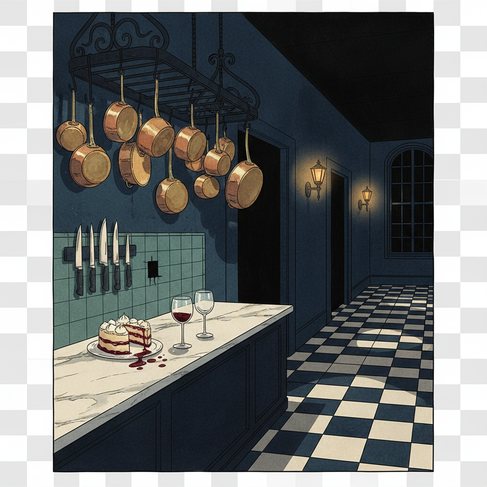

---

### B3 — The Study

**Prompt:**
> **Style:** Dark noir detective illustration, ink linework with muted watercolor washes. Color palette: near-black backgrounds (#0a0a0f), deep navy surfaces (#14141f), warm cream highlights (#e8e6e3), antique gold accents (#d4a843), deep crimson (#c8463b), muted teal (#2a9d8f). 1920s murder mystery atmosphere. Moody lighting with strong shadows. Transparent PNG where noted.
>
> A dark wood-paneled study in a Victorian manor. A heavy mahogany desk covered in scattered documents and an open briefcase. A whiskey decanter and glass sit on a side table. A crackling fireplace casts flickering orange light. Floor-to-ceiling bookshelves line the walls. A crumpled note lies on the floor near the desk. Rich, heavy atmosphere with deep browns, amber, and gold. Viewed at an angle from the door. No text.

**Generated Image:**

---

### B4 — The Lounge

**Prompt:**
> **Style:** Dark noir detective illustration, ink linework with muted watercolor washes. Color palette: near-black backgrounds (#0a0a0f), deep navy surfaces (#14141f), warm cream highlights (#e8e6e3), antique gold accents (#d4a843), deep crimson (#c8463b), muted teal (#2a9d8f). 1920s murder mystery atmosphere. Moody lighting with strong shadows. Transparent PNG where noted.
>
> An elegant Victorian lounge at night. Deep velvet sofas arranged around a low table with an unfinished chess game. A fireplace with dying embers. A vintage rotary telephone sits on a side table with its receiver slightly off the hook. An empty medicine bottle sits near the phone. Crystal chandelier provides dim golden light. Tense, sophisticated atmosphere. Deep burgundy, navy, and gold tones. No text.

**Generated Image:**

---

### B5 — The Garden

**Prompt:**
> **Style:** Dark noir detective illustration, ink linework with muted watercolor washes. Color palette: near-black backgrounds (#0a0a0f), deep navy surfaces (#14141f), warm cream highlights (#e8e6e3), antique gold accents (#d4a843), deep crimson (#c8463b), muted teal (#2a9d8f). 1920s murder mystery atmosphere. Moody lighting with strong shadows. Transparent PNG where noted.
>
> A moonlit Victorian manor garden at night. Stone path winding through manicured hedges and rose bushes. Muddy boot prints clearly visible on the path. A stone bench near the garden wall. The manor's bedroom window is visible in the background, lit faintly. A camera tripod sits abandoned near the roses. Cool teal and navy tones with moonlight silver highlights. Mysterious, exposed atmosphere. No text.

**Generated Image:**
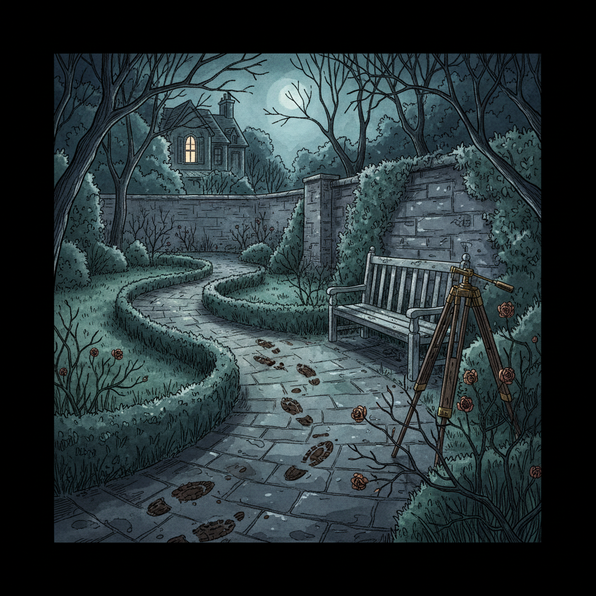

---

### C. SUSPECT PORTRAITS (9 assets)

### C1 — Victor Ashford, Business Partner

**Prompt:**
> **Style:** Dark noir detective illustration, ink linework with muted watercolor washes. Color palette: near-black backgrounds (#0a0a0f), deep navy surfaces (#14141f), warm cream highlights (#e8e6e3), antique gold accents (#d4a843), deep crimson (#c8463b), muted teal (#2a9d8f). 1920s murder mystery atmosphere. Moody lighting with strong shadows. Transparent PNG where noted.
>
> Portrait of a middle-aged man in a sharp tailored suit with a silk tie. Clean-shaven, angular jawline, calculating dark eyes. Slicked-back hair. Confident but guarded expression — a man with secrets. Gold tie pin catches the light. Dramatic noir side-lighting. Bust/shoulder-up, 3/4 angle, looking slightly toward viewer. Ink linework with muted watercolor. Transparent background.

**Generated Image:**
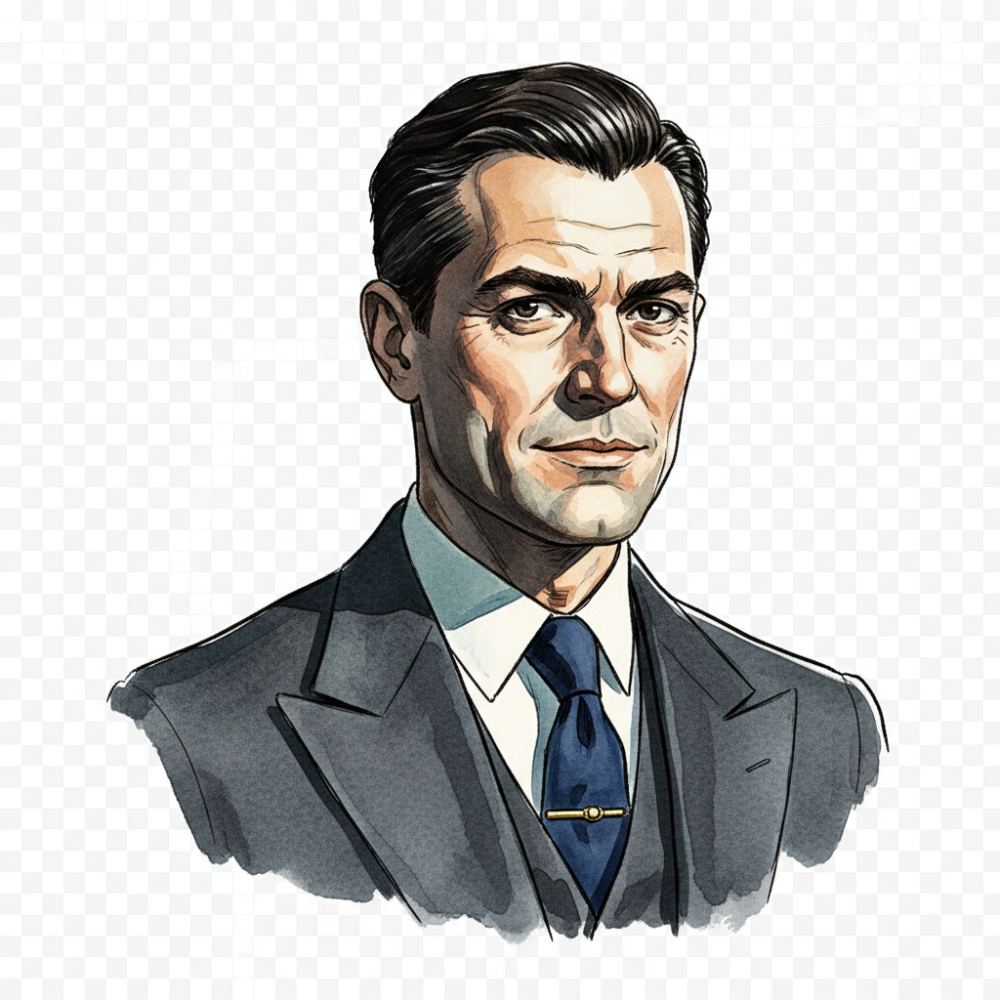

---

### C2 — Elena Castillo, Personal Chef

**Prompt:**
> **Style:** Dark noir detective illustration, ink linework with muted watercolor washes. Color palette: near-black backgrounds (#0a0a0f), deep navy surfaces (#14141f), warm cream highlights (#e8e6e3), antique gold accents (#d4a843), deep crimson (#c8463b), muted teal (#2a9d8f). 1920s murder mystery atmosphere. Moody lighting with strong shadows. Transparent PNG where noted.
>
> Portrait of a woman in professional chef's whites with a clean apron. Dark hair pulled back neatly. Warm brown eyes with a kind but observant expression — she notices everything. Slight flour dust on her shoulder. Warm amber lighting from below suggesting kitchen warmth. Bust/shoulder-up, 3/4 angle, looking slightly toward viewer. Ink linework with muted watercolor. Transparent background.

**Generated Image:**

---

### C3 — Dr. Marcus Webb, Family Doctor

**Prompt:**
> **Style:** Dark noir detective illustration, ink linework with muted watercolor washes. Color palette: near-black backgrounds (#0a0a0f), deep navy surfaces (#14141f), warm cream highlights (#e8e6e3), antique gold accents (#d4a843), deep crimson (#c8463b), muted teal (#2a9d8f). 1920s murder mystery atmosphere. Moody lighting with strong shadows. Transparent PNG where noted.
>
> Portrait of a distinguished older man with gray temples and wire-rimmed glasses. Medical coat over a dress shirt. Tired, intelligent eyes with a hint of nervous energy. A stethoscope around his neck. Composed exterior masking anxiety. Cool clinical lighting. Bust/shoulder-up, 3/4 angle, looking slightly toward viewer. Ink linework with muted watercolor. Transparent background.

**Generated Image:**

---

### C4 — Isabelle Fontaine, Art Dealer & Ex-Lover

**Prompt:**
> **Style:** Dark noir detective illustration, ink linework with muted watercolor washes. Color palette: near-black backgrounds (#0a0a0f), deep navy surfaces (#14141f), warm cream highlights (#e8e6e3), antique gold accents (#d4a843), deep crimson (#c8463b), muted teal (#2a9d8f). 1920s murder mystery atmosphere. Moody lighting with strong shadows. Transparent PNG where noted.
>
> Portrait of an elegant woman in a silk blouse and statement jewelry. Expressive dark eyes with visible grief behind a composed facade. Wavy hair falling past her shoulders. An artist's ring on her finger. Beautiful but haunted. Dramatic chiaroscuro lighting. Bust/shoulder-up, 3/4 angle, looking slightly toward viewer. Ink linework with muted watercolor. Transparent background.

**Generated Image:**

---

### C5 — Thomas Grey, Groundskeeper

**Prompt:**
> **Style:** Dark noir detective illustration, ink linework with muted watercolor washes. Color palette: near-black backgrounds (#0a0a0f), deep navy surfaces (#14141f), warm cream highlights (#e8e6e3), antique gold accents (#d4a843), deep crimson (#c8463b), muted teal (#2a9d8f). 1920s murder mystery atmosphere. Moody lighting with strong shadows. Transparent PNG where noted.
>
> Portrait of a weathered middle-aged man in work clothes — flannel shirt, rough hands. Strong jaw, deep-set eyes with a guarded, closed-off expression. Sun-damaged skin. A leaf or twig caught in his collar. Earthy, natural lighting with deep shadows. Bust/shoulder-up, 3/4 angle, looking slightly toward viewer. Ink linework with muted watercolor. Transparent background.

**Generated Image:**

---

### C6 — Priya Sharma, Accountant

**Prompt:**
> **Style:** Dark noir detective illustration, ink linework with muted watercolor washes. Color palette: near-black backgrounds (#0a0a0f), deep navy surfaces (#14141f), warm cream highlights (#e8e6e3), antique gold accents (#d4a843), deep crimson (#c8463b), muted teal (#2a9d8f). 1920s murder mystery atmosphere. Moody lighting with strong shadows. Transparent PNG where noted.
>
> Portrait of a sharp-featured woman in professional business attire — blazer, crisp collar. Hair in a neat bun. Intelligent, analytical eyes behind stylish glasses. Precise and observant demeanor. She holds a pen like a weapon. Cool neutral lighting. Bust/shoulder-up, 3/4 angle, looking slightly toward viewer. Ink linework with muted watercolor. Transparent background.

**Generated Image:**

---

### C7 — James Whitmore, Lawyer

**Prompt:**
> **Style:** Dark noir detective illustration, ink linework with muted watercolor washes. Color palette: near-black backgrounds (#0a0a0f), deep navy surfaces (#14141f), warm cream highlights (#e8e6e3), antique gold accents (#d4a843), deep crimson (#c8463b), muted teal (#2a9d8f). 1920s murder mystery atmosphere. Moody lighting with strong shadows. Transparent PNG where noted.
>
> Portrait of a middle-aged man in an expensive three-piece suit. Distinguished bearing, silver at the temples. Calculating blue eyes. A legal pad barely visible at the bottom edge. The expression of a man who knows too much. Formal, slightly cold lighting. Bust/shoulder-up, 3/4 angle, looking slightly toward viewer. Ink linework with muted watercolor. Transparent background.

**Generated Image:**
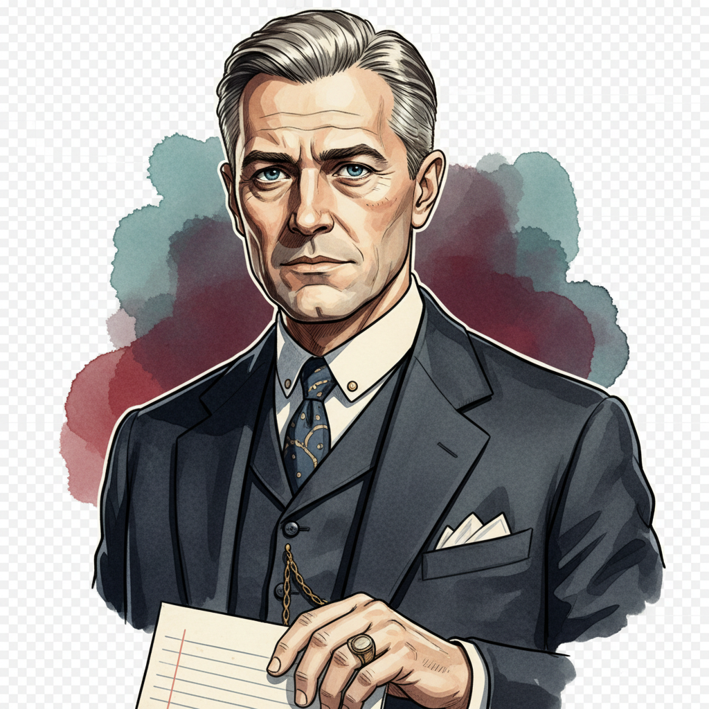

---

### C8 — Celeste Duval, Victim's Sister

**Prompt:**
> **Style:** Dark noir detective illustration, ink linework with muted watercolor washes. Color palette: near-black backgrounds (#0a0a0f), deep navy surfaces (#14141f), warm cream highlights (#e8e6e3), antique gold accents (#d4a843), deep crimson (#c8463b), muted teal (#2a9d8f). 1920s murder mystery atmosphere. Moody lighting with strong shadows. Transparent PNG where noted.
>
> Portrait of a woman in formal dark clothing suggesting mourning. Delicate features, red-rimmed eyes from crying but maintaining dignity. A locket necklace. Devastated yet determined expression — she wants answers. Soft, melancholic side-lighting. Bust/shoulder-up, 3/4 angle, looking slightly toward viewer. Ink linework with muted watercolor. Transparent background.

**Generated Image:**

---

### C9 — Ren Nakamura, Photographer & Guest

**Prompt:**
> **Style:** Dark noir detective illustration, ink linework with muted watercolor washes. Color palette: near-black backgrounds (#0a0a0f), deep navy surfaces (#14141f), warm cream highlights (#e8e6e3), antique gold accents (#d4a843), deep crimson (#c8463b), muted teal (#2a9d8f). 1920s murder mystery atmosphere. Moody lighting with strong shadows. Transparent PNG where noted.
>
> Portrait of a young man with an artistic, casual look — open collar shirt, camera strap visible at the shoulder. Sharp perceptive eyes, slightly messy hair. An outsider who sees everything through a lens. Creative energy meets quiet observation. Natural mixed lighting. Bust/shoulder-up, 3/4 angle, looking slightly toward viewer. Ink linework with muted watercolor. Transparent background.

**Generated Image:**
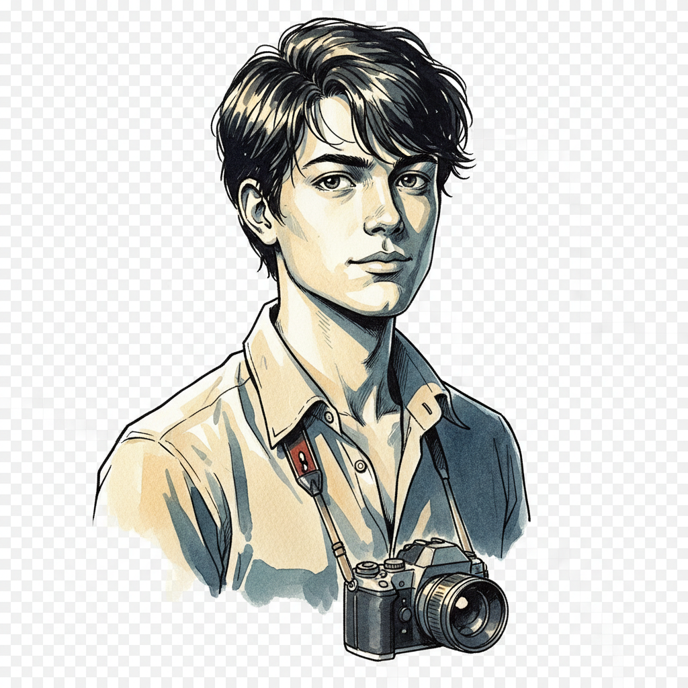

---

### D. CLUE ITEM ICONS (11 assets)

### D1 — Broken Perfume Bottle (KEY EVIDENCE)

**Prompt:**
> **Style:** Dark noir detective illustration, ink linework with muted watercolor washes. Color palette: near-black backgrounds (#0a0a0f), deep navy surfaces (#14141f), warm cream highlights (#e8e6e3), antique gold accents (#d4a843), deep crimson (#c8463b), muted teal (#2a9d8f). 1920s murder mystery atmosphere. Moody lighting with strong shadows. Transparent PNG where noted.
>
> A shattered ornate glass perfume bottle with its gold stopper displaced. Amber liquid pooling beneath. A faint chemical vapor rising. Gold accent glow around the object suggesting key evidence. Centered on transparent background. 200x200px icon style. Ink linework with watercolor.

**Generated Image:**

---

### D2 — Smudged Fingerprints

**Prompt:**
> **Style:** Dark noir detective illustration, ink linework with muted watercolor washes. Color palette: near-black backgrounds (#0a0a0f), deep navy surfaces (#14141f), warm cream highlights (#e8e6e3), antique gold accents (#d4a843), deep crimson (#c8463b), muted teal (#2a9d8f). 1920s murder mystery atmosphere. Moody lighting with strong shadows. Transparent PNG where noted.
>
> A glass surface or doorknob showing multiple overlapping smudged fingerprints. Dusting powder residue visible. The prints are blurred and partial. Centered on transparent background. 200x200px icon style. Ink linework with muted watercolor.

**Generated Image:**

---

### D3 — Torn Business Letter

**Prompt:**
> **Style:** Dark noir detective illustration, ink linework with muted watercolor washes. Color palette: near-black backgrounds (#0a0a0f), deep navy surfaces (#14141f), warm cream highlights (#e8e6e3), antique gold accents (#d4a843), deep crimson (#c8463b), muted teal (#2a9d8f). 1920s murder mystery atmosphere. Moody lighting with strong shadows. Transparent PNG where noted.
>
> A torn piece of formal letterhead with visible handwriting. The paper has ragged torn edges. A wax seal is partially visible. Cream paper with blue-black ink. Centered on transparent background. 200x200px icon style. Ink linework with watercolor.

**Generated Image:**
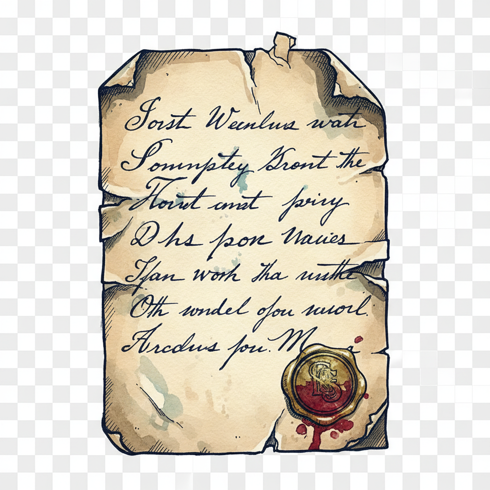

---

### D4 — Wine Glass with Residue

**Prompt:**
> **Style:** Dark noir detective illustration, ink linework with muted watercolor washes. Color palette: near-black backgrounds (#0a0a0f), deep navy surfaces (#14141f), warm cream highlights (#e8e6e3), antique gold accents (#d4a843), deep crimson (#c8463b), muted teal (#2a9d8f). 1920s murder mystery atmosphere. Moody lighting with strong shadows. Transparent PNG where noted.
>
> An elegant wine glass with a suspicious discolored residue coating the inside bottom. The glass is half-empty with a dark ring stain. Centered on transparent background. 200x200px icon style. Ink linework with watercolor.

**Generated Image:**

---

### D5 — Missing Chef's Knife (the gap)

**Prompt:**
> **Style:** Dark noir detective illustration, ink linework with muted watercolor washes. Color palette: near-black backgrounds (#0a0a0f), deep navy surfaces (#14141f), warm cream highlights (#e8e6e3), antique gold accents (#d4a843), deep crimson (#c8463b), muted teal (#2a9d8f). 1920s murder mystery atmosphere. Moody lighting with strong shadows. Transparent PNG where noted.
>
> A magnetic knife rack mounted on tile wall with several chef's knives — and one conspicuous empty slot. The outline/shadow of the missing knife is visible. Centered on transparent background. 200x200px icon style. Ink linework with watercolor.

**Generated Image:**

---

### D6 — Insurance Documents (KEY EVIDENCE)

**Prompt:**
> **Style:** Dark noir detective illustration, ink linework with muted watercolor washes. Color palette: near-black backgrounds (#0a0a0f), deep navy surfaces (#14141f), warm cream highlights (#e8e6e3), antique gold accents (#d4a843), deep crimson (#c8463b), muted teal (#2a9d8f). 1920s murder mystery atmosphere. Moody lighting with strong shadows. Transparent PNG where noted.
>
> An open leather briefcase with insurance policy documents spilling out. Numbers and legal text partially visible on cream paper. Gold accent glow suggesting key evidence. Centered on transparent background. 200x200px icon style. Ink linework with watercolor.

**Generated Image:**

---

### D7 — Crumpled Note (KEY EVIDENCE)

**Prompt:**
> **Style:** Dark noir detective illustration, ink linework with muted watercolor washes. Color palette: near-black backgrounds (#0a0a0f), deep navy surfaces (#14141f), warm cream highlights (#e8e6e3), antique gold accents (#d4a843), deep crimson (#c8463b), muted teal (#2a9d8f). 1920s murder mystery atmosphere. Moody lighting with strong shadows. Transparent PNG where noted.
>
> A crumpled handwritten note on cream paper. Hasty, emotional handwriting partially legible. The paper has deep creases and wrinkles. Gold accent glow suggesting key evidence. Centered on transparent background. 200x200px icon style. Ink linework with watercolor.

**Generated Image:**
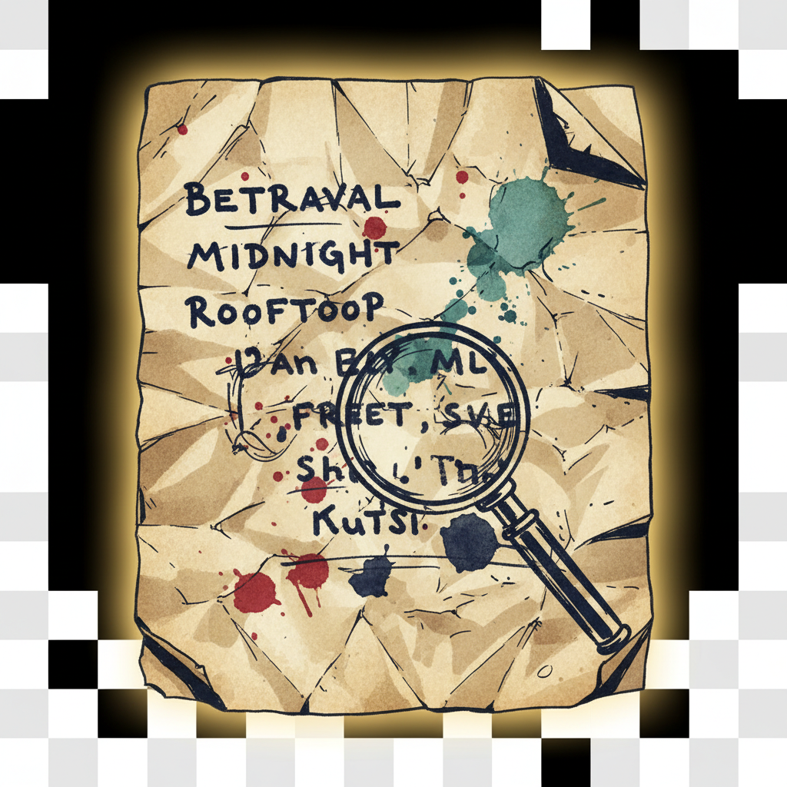

---

### D8 — Phone Records (KEY EVIDENCE)

**Prompt:**
> **Style:** Dark noir detective illustration, ink linework with muted watercolor washes. Color palette: near-black backgrounds (#0a0a0f), deep navy surfaces (#14141f), warm cream highlights (#e8e6e3), antique gold accents (#d4a843), deep crimson (#c8463b), muted teal (#2a9d8f). 1920s murder mystery atmosphere. Moody lighting with strong shadows. Transparent PNG where noted.
>
> A vintage rotary telephone with a paper call log or printout draped over it. Times and phone numbers visible on the paper strip. Gold accent glow suggesting key evidence. Centered on transparent background. 200x200px icon style. Ink linework with watercolor.

**Generated Image:**

---

### D9 — Empty Medicine Bottle

**Prompt:**
> **Style:** Dark noir detective illustration, ink linework with muted watercolor washes. Color palette: near-black backgrounds (#0a0a0f), deep navy surfaces (#14141f), warm cream highlights (#e8e6e3), antique gold accents (#d4a843), deep crimson (#c8463b), muted teal (#2a9d8f). 1920s murder mystery atmosphere. Moody lighting with strong shadows. Transparent PNG where noted.
>
> A prescription medicine bottle lying on its side, empty and open. The label shows a name and dosage (illegible but suggested). The cap is off nearby. Centered on transparent background. 200x200px icon style. Ink linework with watercolor.

**Generated Image:**
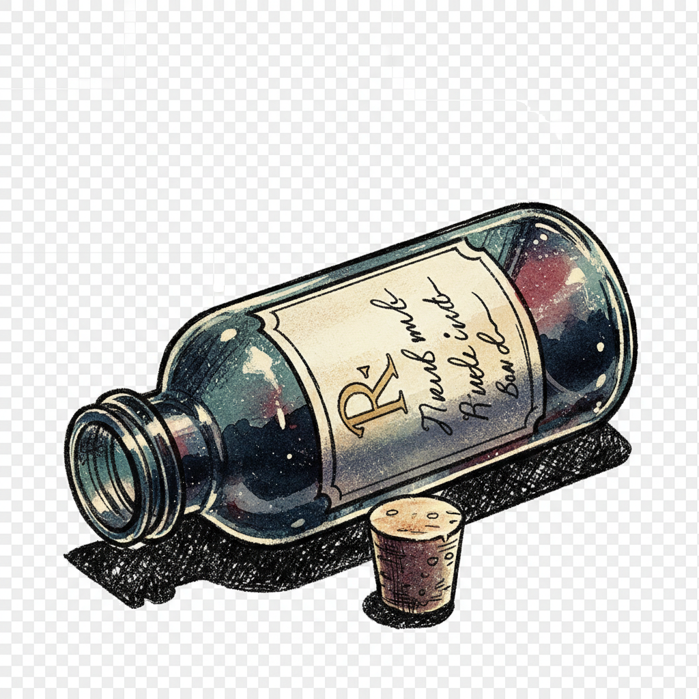

---

### D10 — Muddy Footprints

**Prompt:**
> **Style:** Dark noir detective illustration, ink linework with muted watercolor washes. Color palette: near-black backgrounds (#0a0a0f), deep navy surfaces (#14141f), warm cream highlights (#e8e6e3), antique gold accents (#d4a843), deep crimson (#c8463b), muted teal (#2a9d8f). 1920s murder mystery atmosphere. Moody lighting with strong shadows. Transparent PNG where noted.
>
> A pair of muddy boot prints on stone — clearly showing a distinctive sole pattern. Mud spatters around the prints. Earth-toned browns against gray stone. Centered on transparent background. 200x200px icon style. Ink linework with watercolor.

**Generated Image:**
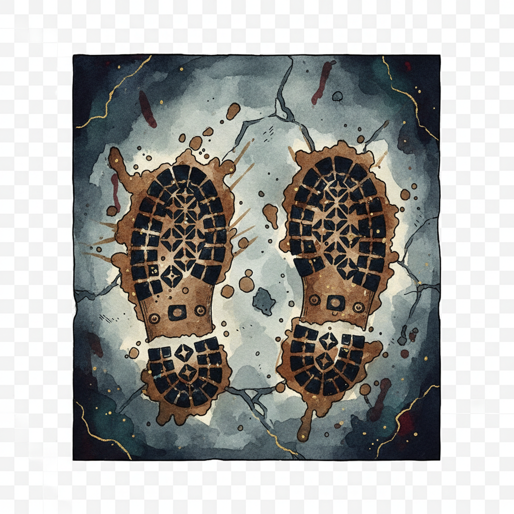

---

### D11 — Camera with Photos (KEY EVIDENCE)

**Prompt:**
> **Style:** Dark noir detective illustration, ink linework with muted watercolor washes. Color palette: near-black backgrounds (#0a0a0f), deep navy surfaces (#14141f), warm cream highlights (#e8e6e3), antique gold accents (#d4a843), deep crimson (#c8463b), muted teal (#2a9d8f). 1920s murder mystery atmosphere. Moody lighting with strong shadows. Transparent PNG where noted.
>
> A vintage film camera with a developed photograph partially sliding out. The photo shows a garden scene at dusk with a timestamp. Gold accent glow suggesting key evidence. Centered on transparent background. 200x200px icon style. Ink linework with watercolor.

**Generated Image:**
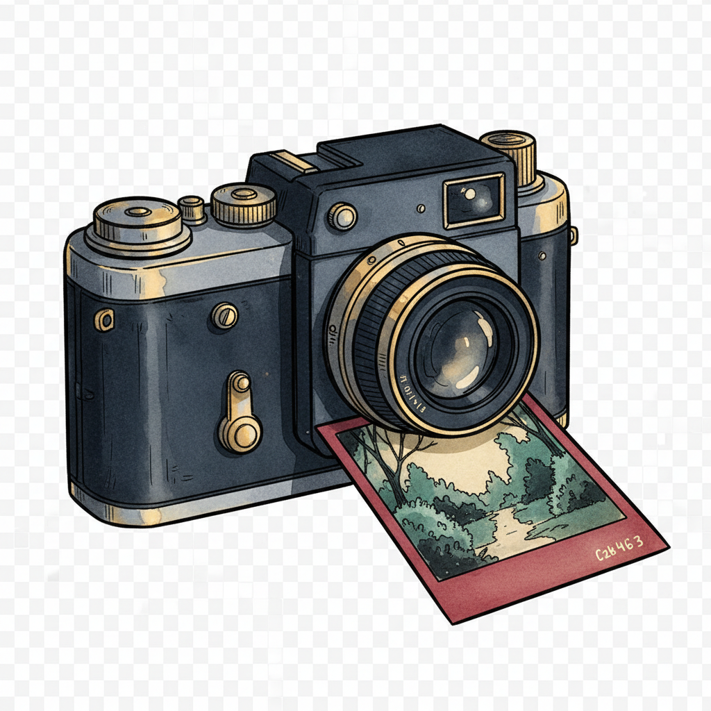

---

### E. WEAPON ICONS (5 assets)

### E1 — Poison Vial

**Prompt:**
> **Style:** Dark noir detective illustration, ink linework with muted watercolor washes. Color palette: near-black backgrounds (#0a0a0f), deep navy surfaces (#14141f), warm cream highlights (#e8e6e3), antique gold accents (#d4a843), deep crimson (#c8463b), muted teal (#2a9d8f). 1920s murder mystery atmosphere. Moody lighting with strong shadows. Transparent PNG where noted.
>
> A small glass vial with a cork stopper containing luminous green-purple liquid. A skull-and-crossbones label partially visible. Faint vapor wisps from the top. Crimson undertone accent. Centered on transparent background. 200x200px. Ink linework with watercolor.

**Generated Image:**
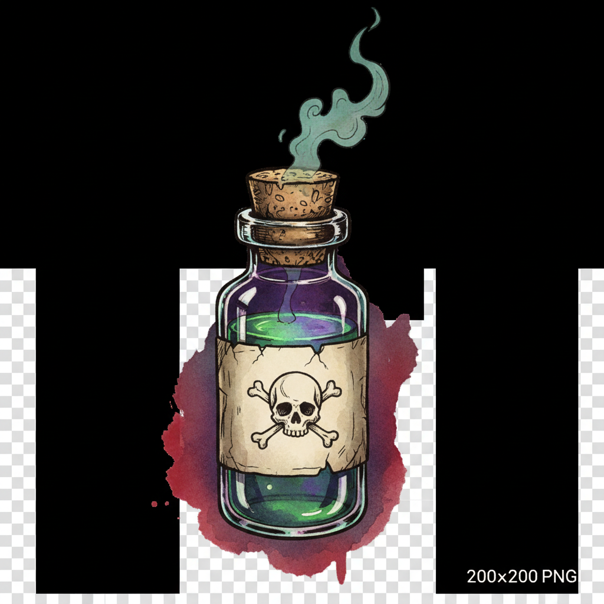

---

### E2 — Kitchen Knife

**Prompt:**
> **Style:** Dark noir detective illustration, ink linework with muted watercolor washes. Color palette: near-black backgrounds (#0a0a0f), deep navy surfaces (#14141f), warm cream highlights (#e8e6e3), antique gold accents (#d4a843), deep crimson (#c8463b), muted teal (#2a9d8f). 1920s murder mystery atmosphere. Moody lighting with strong shadows. Transparent PNG where noted.
>
> A sharp professional chef's knife with a polished steel blade reflecting dim light. Dark wooden handle with rivets. The blade edge catches a glint of light. Crimson undertone accent. Centered on transparent background. 200x200px. Ink linework with watercolor.

**Generated Image:**
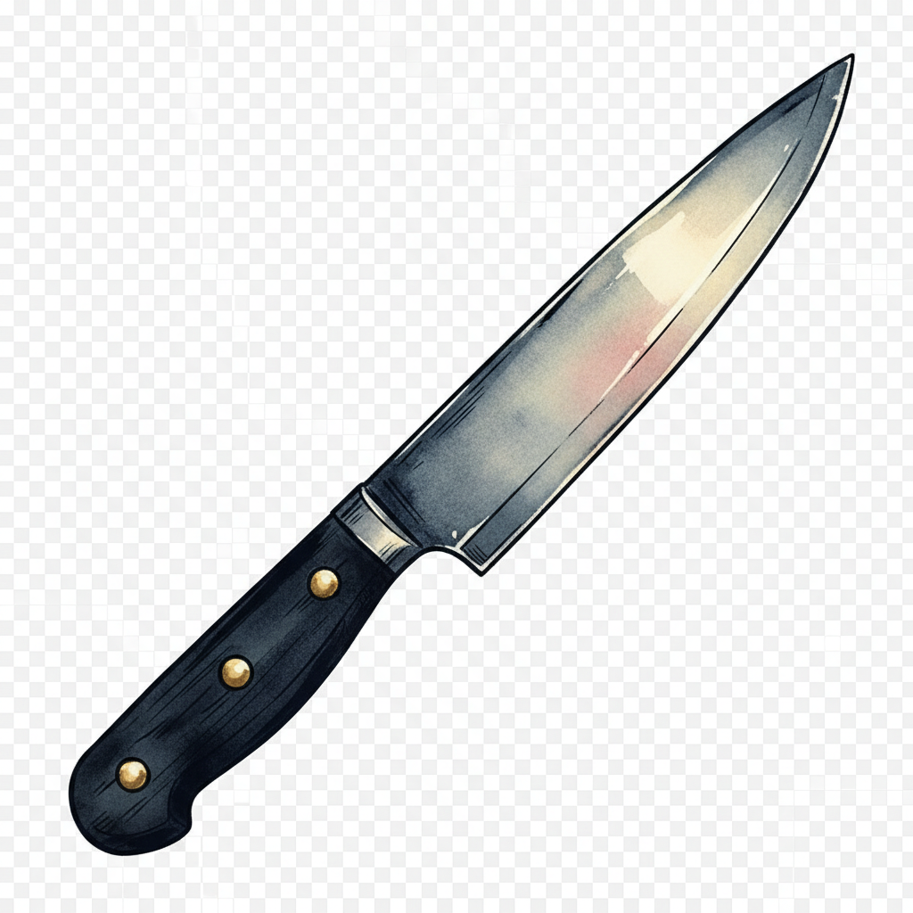

---

### E3 — Candlestick

**Prompt:**
> **Style:** Dark noir detective illustration, ink linework with muted watercolor washes. Color palette: near-black backgrounds (#0a0a0f), deep navy surfaces (#14141f), warm cream highlights (#e8e6e3), antique gold accents (#d4a843), deep crimson (#c8463b), muted teal (#2a9d8f). 1920s murder mystery atmosphere. Moody lighting with strong shadows. Transparent PNG where noted.
>
> An ornate silver candlestick with heavy base, no candle. Decorative baroque engravings on the stem. The heavy base suggests it could be a weapon. Crimson undertone accent. Centered on transparent background. 200x200px. Ink linework with watercolor.

**Generated Image:**
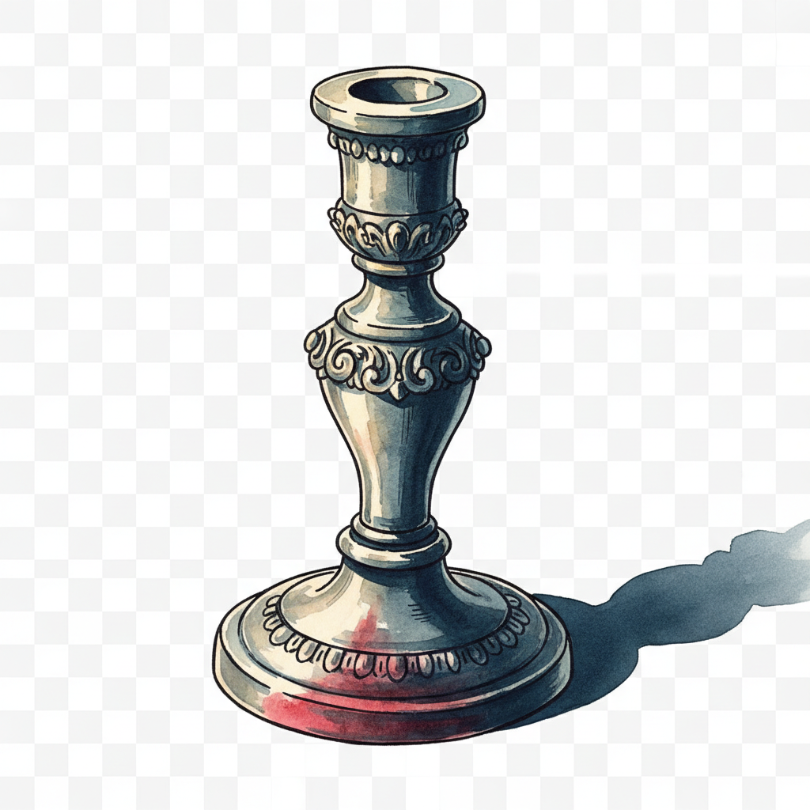

---

### E4 — Letter Opener

**Prompt:**
> **Style:** Dark noir detective illustration, ink linework with muted watercolor washes. Color palette: near-black backgrounds (#0a0a0f), deep navy surfaces (#14141f), warm cream highlights (#e8e6e3), antique gold accents (#d4a843), deep crimson (#c8463b), muted teal (#2a9d8f). 1920s murder mystery atmosphere. Moody lighting with strong shadows. Transparent PNG where noted.
>
> An ornate metal letter opener with a decorative handle featuring a lion's head pommel. The blade is thin and pointed. Antique brass finish. Crimson undertone accent. Centered on transparent background. 200x200px. Ink linework with watercolor.

**Generated Image:**
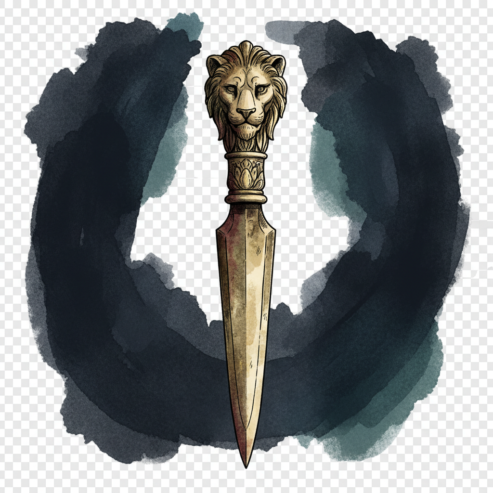

---

### E5 — Garden Shears

**Prompt:**
> **Style:** Dark noir detective illustration, ink linework with muted watercolor washes. Color palette: near-black backgrounds (#0a0a0f), deep navy surfaces (#14141f), warm cream highlights (#e8e6e3), antique gold accents (#d4a843), deep crimson (#c8463b), muted teal (#2a9d8f). 1920s murder mystery atmosphere. Moody lighting with strong shadows. Transparent PNG where noted.
>
> Heavy-duty garden pruning shears with long metal blades and wooden handles. A spot of rust on one blade. Dirt on the handles. Crimson undertone accent. Centered on transparent background. 200x200px. Ink linework with watercolor.

**Generated Image:**

---
